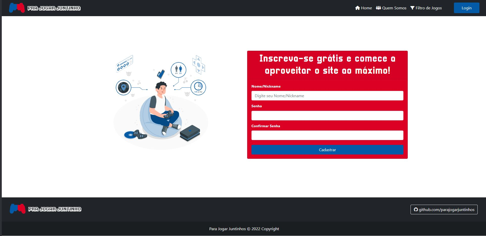
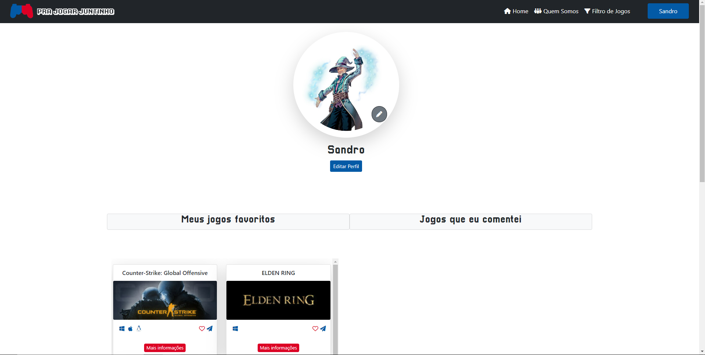

# Programação de Funcionalidades

Nesta seção estão descritos os artefatos e estruturas de dados criados para atender aos requisitos previstos nas <a href="./especification.md">Especificações do Projeto</a>, bem como as instruções para acesso e verificação da implementação. As tecnologias utilizadas se baseiam nas linguagens HTML, CSS e JavaScript.

## Página Inicial

Aqui onde nosso site se inicia, uma tela repleta de funções que faz ligação com as demais do site. No início da página será disponibilizado um carrossel dos jogos mais buscados no site.

Logo em seguida terá um legenda com informações sobre qual plataforma os jogos se encontram disponíveis.

E por fim a exibição dos jogos em formato de cards com alguma seleções de gêneros pré definidos.

Caso prefira buscar por outras modalidades basta ir no botão "Filtro de Jogos" que se encontra na nosso Menu

 

## Filtro de Jogos

### Requisitos

- RF-001 - Disponibilizar área com lista de jogos eletrônicos cooperativos em categorias
- RF-003 - Filtrar jogos eletrônicos cooperativos por categorias
- RF-004 - Permitir que o usuário navegue pelas categorias de jogos

Para atender aos requisitos RF-001, RF-003 e RF-004 foi desenvolvido a página de Filtro de Jogos.

Será exibido um botão que recolhe e expande onde o usuário terá acesso a uma legenda dos ícones que ele encontrará nos cards dos jogos que facilitará quais plataformas o jogo se encontra.

Abaixo da legenda do lado esquerdo se encontra o Filtro de Jogos, onde o usuário podera colocar informações como nome do jogo, gênero e plataforma desejada, podendo assim fazer pesquisas nos jogos disponíveis no site.

Feito o processo de filtro o usuário deverá clicar no botão buscar que retornará os resultados da pesquisa feita pelo usuário. O resultado da pesquisa será apresentado ao lado do Filtro de Jogos em forma de lista, onde apareceram os cards com algumas informações do jogos, podendo também favoritar, compartilhar o link do jogo ou ver mais informações do jogos escolhido.

 

## Informações do Jogo

### Requisitos

- RF-002 - Exibir página com informações do jogo eletrônico cooperativo selecionado
- RF-010 - Permitir usuário a postar comentários no jogo
- RF-011 - Exibir comentários de outro usuário na página com informações do jogo selecionado

Para atender aos requisitos RF-002, RF-010 e RF-011 foi desenvolvido a página de Informações do Jogo.

Ao clicar em um card de um jogo específico aparecerá para o usuário a página de Informações do Jogo, nela ele tera acesso à esquerda um vídeo do jogo acompanhado de uma descrição do jogo.

> adicionar imagem do video e da descrição (ainda não funciona)

O vídeo foi adicionado da `seguinte maneira` e a descrição `assim`.

Do lado direito da página aparecerá as informações do jogo, tais como uma imagem do jogo acompanhada de ícones descritivos, informações sobre o tipo de co-op disponível, as plataformas que o usuário poderá jogar o jogo, gêneros, tema e a data de lançamento.

> adicionar imagem do card lateral

As informações foram implementadas da `seguinte maneira`.

Abaixo do vídeo e da descrição aparecerá os comentários que já foram feitos por outros usuários sobre aquele jogo, quando logado aparecerá o campo onde o usuário poderá fazer o próprio comentário.

> adicionar imagem dos comentarios sem login
> adicionar imagem dos comentarios com login

Os comentários foram feitos da `seguinte forma`

 

## Login

### Requisitos

- RF-006 - Permitir login do usuário

Para atender ao requisito RF-006 foi desenvolvido a página de Login.

Ao clicar em fazer login, disponível no menu da página inicial, irá carregar a tela de login para o usuário.

Será exibido dois campos, Nome/Nickname e Password respectivamente para o usuário entrar com um cadastro já realizado no site, se não possuir cadastro haverá um botão que levará até a tela de Cadastro.

 

## Cadastro

### Requisitos

- RF-005 - Permitir cadastro de usuário

Para atender ao requisito RF-005 foi desenvolvido a página de Cadastro.

Será disponibilizado ao usuário um formulário onde ele poderá cadastrar suas informações como Nome/Nickname e senha (que são IDs armazenados em .json e fazem a validação atráves do JavaScript) para criar um usuário no site e fazer login futuramente.

Ao final depois de inserir seus dados, para confirmar cadastro no Pra Jogar Juntinho basta clicar no botão "Cadastrar" que executará a linha de códigos seguinte: `cadastroForm.addEventListener("submit", (evt) => {`, após o JavaScript conferir se a senha está igual ao campo de confirmar a senha dado por: `if (document.getElementById("senha").value === document.getElementById("confirmar-senha").value) {`, ele verificará se o usuário já existe no storage da seguinte forma: `validacao = usuarios.some(u => {return u.nome === document.getElementById('nome').value ? true : false;});`. As validações estando OK, o cadastro será efetivado e o usuário será levado de volta a tela inicial `window.location.href = "http://127.0.0.1:5500/src/index.html";`, pronto, agora você consegue comentar e favoritar seus jogos preferidos para poder jogar mais tarde com seus amigos.

 

## Favoritar e Avaliar um Jogo

### Requisitos

- RF-007 - Permitir o usuário a favoritar jogos
- RF-009 - Permitir usuário avaliar um jogo

Para atender aos requisitos RF-007 foi desenvolvido nos cards dos jogos um botão com símbolo de coração.

Os jogos favoritados ficará disponível no perfil do usuário.

`Falta ainda a parte de avaliar o jogo`

 

## Tela de Perfil

### Requisitos

- RF-008 - Exibir lista de jogos favoritado do usuário logado

Para atender ao requisito foi desenvolvido a página de Tela de Perfil.

Ao clicar no botão onde estiver escrito seu Nome/NickName no menu disponivel após o login aparecerá a tela de perfil.

Nela o usuário podera visualizar a lista de jogos favoritadas e comentados, além de poder editar informações como o ícone de perfil, nome/nickname e senha.

 
