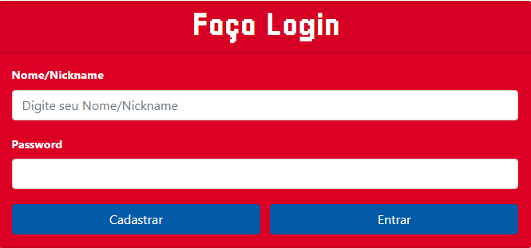
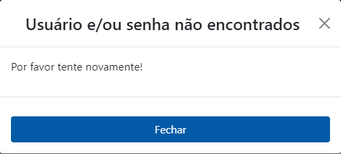
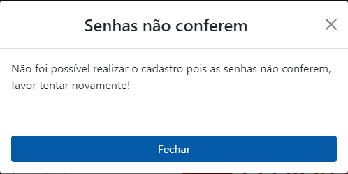
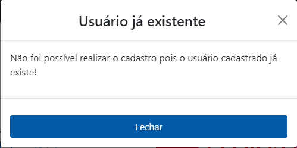

# Programação de Funcionalidades

Nesta seção estão descritos os artefatos e estruturas de dados criados para atender aos requisitos previstos nas <a href="./especification.md">Especificações do Projeto</a>, bem como as instruções para acesso e verificação da implementação. As tecnologias utilizadas se baseiam nas linguagens HTML, CSS e JavaScript.

## Página Inicial

Aqui onde nosso site se inicia, uma tela repleta de funções que faz ligação com as demais do site. No início da página será disponibilizado um carrossel das principais notícias no mundo dos jogos.


Logo em seguida será exibido o botão que recolhe e expande onde o usuário terá acesso a uma legenda dos ícones que ele encontrará nos cards dos jogos que facilitará quais plataformas o jogo se encontra.


E por fim a exibição dos jogos em formato de cards com alguma seleções de gêneros pré definidos.


Caso prefira buscar por outras modalidades basta ir no botão "Filtro de Jogos" que se encontra na nosso Menu.

<br/>

## Filtro de Jogos

### Requisitos

- RF-001 - Disponibilizar área com lista de jogos eletrônicos cooperativos em categorias
- RF-003 - Filtrar jogos eletrônicos cooperativos por categorias
- RF-004 - Permitir que o usuário navegue pelas categorias de jogos

Para atender aos requisitos RF-001, RF-003 e RF-004 foi desenvolvido a página de Filtro de Jogos.

 Abaixo da legenda do lado esquerdo se encontra o Filtro de Jogos, onde o usuário podera colocar informações como nome do jogo, gênero e plataforma desejada, podendo assim fazer pesquisas nos jogos disponíveis no site.


Feito o processo de filtro o usuário deverá clicar no botão buscar que retornará os resultados da pesquisa feita pelo usuário. O resultado da pesquisa será apresentado ao lado do Filtro de Jogos em forma de lista, onde apareceram os cards com algumas informações do jogos, podendo também favoritar, compartilhar o link do jogo ou ver mais informações do jogos escolhido.

<br/>

## Informações do Jogo

### Requisitos

- RF-002 - Exibir página com informações do jogo eletrônico cooperativo selecionado
- RF-010 - Permitir usuário a postar comentários no jogo
- RF-011 - Exibir comentários de outro usuário na página com informações do jogo selecionado

Para atender aos requisitos RF-002, RF-010 e RF-011 foi desenvolvido a página de Informações do Jogo.

Ao clicar em um card de um jogo específico aparecerá para o usuário a página de Informações do Jogo, nela ele tera acesso à esquerda um vídeo do jogo acompanhado de uma descrição do jogo.

> adicioanar imagem do video e da descrição (ainda não funciona)

O vídeo foi adicionado da `seguinte maneira` e a descrição `assim`.

Do lado direito da página aparecerá as informações do jogo, tais como uma imagem do jogo acompanhada de ícones descritivos, informações sobre o tipo de co-op disponível, as plataformas que o usuário poderá jogar o jogo, gêneros, tema e a data de lançamento.

> adicionar imagem do card lateral

As informações foram implementadas da `seguinte maneira`.

Abaixo do vídeo e da descrição aparecerá os comentários que já foram feitos por outros usuários sobre aquele jogo, quando logado aparecerá o campo onde o usuário poderá fazer o próprio comentário.

> adicionar imagem dos comentarios sem login
> adicionar imagem dos comentarios com login

Os comentários foram feitos da `seguinte forma`

## Login

### Requisitos

- RF-006 - Permitir login do usuário

Para atender ao requisito RF-006 foi desenvolvido a página de Login.

Ao clicar em fazer login, disponível no menu da página inicial, irá carregar a tela de login para o usuário.



Será exibido dois títulos, Nome/Nickname e Password do tipo `label` respectivamente, logo em seguida mais dois campos do tipo `imput` para receber os valores que o usuário digitar para fazer login no site. Os botões que são do tipo `button` com personalização do boostrap com a classe `btn-primary` são para cadastrar um usuário caso não possua acesso ao site e o outro para enviar a requisição do usuário que irá logar no site. Os dados são registrados no localStorage do navegador de acordo com a estrutura de dados presente em `src/js/login.js`.

Em caso de erro ao autenticar o login será exibido um modal informando que os dados estão errados.



## Cadastro

### Requisitos

- RF-005 - Permitir cadastro de usuário

Para atender ao requisito RF-005 foi desenvolvido a página de Cadastro.

Será disponibilizado ao usuário um formulário composto por `label`, `input` e um `button` onde ele poderá cadastrar suas informações como Nome/Nickname e senha para criar um usuário no site e fazer login futuramente. Estes usuários cadastrados são registrados no localStorage do navegador de acordo com a estrutura de dados presente em `src/js/cadastro.js`.


Após inserir seus dados, para confirmar cadastro no Pra Jogar Juntinho basta clicar no botão "Cadastrar", então os dados informados são armazenados em um arquivo JSON `src/db/usuarios.json`. Pronto você será redirecionado para a tela inicial e agora você consegue comentar e favoritar seus jogos preferidos para poder jogar mais tarde com seus amigos. A estrutura de dados utilizada é JSON, conforme exemplo a seguir:

```
   "usuarios": [
    {
      "id": 1,
      "nome": "Lucas",
      "senha": "Brasil1010",
      "avatar": "cody"
    },
```
Em caso de erro ao autenticar o cadastro será exibido um modal informando o que não está conforme.




## Favoritar e Avaliar um Jogo

### Requisitos

- RF-007 - Permitir o usuário a favoritar jogos
- RF-009 - Permitir usuário avaliar um jogo

O botão sem o jogo favoritado ficará assim:
<div align="center">


</div>

E com o jogo favoritado assim:
<div align="center">


</div>

Para atender ao requisito RF-007 foi desenvolvido nos cards dos jogos um botão com símbolo de coração. Se o usuário não estiver logado e tentar mesmo assim favoritar um jogo o site redireciona para a tela de login.
Caso estiver logado o evento será acionado por meio de um `onclick` executando a função `favoritar` armazenada no arquivo `src/js/informacoes-jogo.js`. Caso deseja remover dos favoritos o jogo basta clicar no ícone novamente que irá chamar a função `desfavoritar` e o mesmo será removido. Os jogos favoritados e os comentários feitos ficará disponível na tela de perfil

Agora para o requisito RF-009 foi disponilizado uma seção de comentários que se encontra na tela de Informações do Jogo.


No `imput` você coloca o comentário que deseja sobre o jogo selecionado e para enviar basta clicar no `btn btn-primary` do Boostrap. Nesse botão se encontra um evento de `onclick` que chama a função `comentar` armazenada no arquivo `src/js/informacoes-jogo.js`. Pronto seu comentário foi publicado no site


 
<br/>

## Tela de Perfil

### Requisitos

- RF-008 - Exibir lista de jogos favoritado do usuário logado

Para atender ao requisito foi desenvolvido a página de Tela de Perfil.

Ao clicar no botão onde estiver escrito seu Nome/NickName no menu disponivel após o login aparecerá a tela de perfil.


Nela o usuário podera visualizar a lista de jogos favoritadas e comentados, além de poder editar informações como o ícone de perfil, nome/nickname e senha.

<br/>
